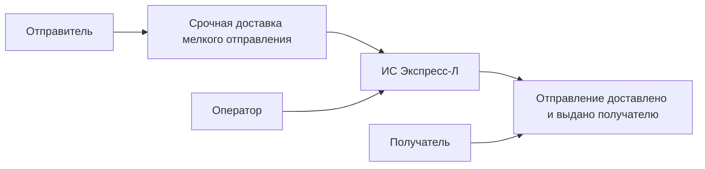

# 01. Описание системы

## Название

ИС "Экспресс-Л": скоростная перевозка мелких отправлений на ВСМ Москва - Санкт-Петербург.

## Проблема

В первые годы эксплуатации ВСМ пассажирская инфраструктура может использоваться не полностью. При этом рынок электронной торговли, документов и срочных мелких отправлений требует более быстрой доставки между крупными городами, чем обычная наземная логистика.

Проектируемая ИС должна связать клиента, пункт приема, поездную логистику, постаматы, ПВЗ, курьерскую доставку и оператора перевозки в один управляемый процесс. Пользователь должен видеть понятный статус отправления, а оператор - контролировать прием, передачу в поезд, прибытие, выдачу и исключительные ситуации.

## Целевые пользователи

| Пользователь | Потребность |
|---|---|
| Отправитель | Быстро оформить отправление, понять условия перевозки, сдать отправление и отслеживать статус |
| Получатель | Получить уведомление и забрать отправление удобным способом |
| Оператор пункта приема | Проверить отправление, принять или отказать с причиной |
| Логистический оператор | Контролировать маршрут, передачу в поезд, прибытие и выдачу |
| Служба поддержки | Найти историю статусов, объяснить задержку, оформить расследование |

## Основной результат для пользователя

Отправитель создает заявку, сдает отправление в пункт приема, получает номер отслеживания и видит статусы перевозки. Получатель получает уведомление о готовности к выдаче и забирает отправление через постамат, ПВЗ или курьера.

Ключевая ценность MVP - предсказуемая скоростная доставка мелких отправлений между Москвой и Санкт-Петербургом с прозрачным цифровым сопровождением.

## Границы MVP

В первую версию входят:

- оформление заявки на мелкое отправление;
- первичная проверка обязательных полей и ограничений;
- ожидание сдачи отправления в пункт приема в течение 24 часов;
- физическая проверка отправления оператором;
- подбор ближайшего возможного поезда;
- формирование маршрута перевозки;
- контроль передачи в поезд и прибытия;
- передача в постамат, ПВЗ или курьерскую доставку;
- уведомления отправителя и получателя;
- служебное расследование при повреждении или задержке;
- панель оператора для ручного контроля проблемных отправлений.

В первую версию не входят:

- полноценные B2B-грузовые перевозки;
- договорная работа с корпоративными клиентами;
- специализированные грузовые составы;
- проектирование распределительных центров;
- финансово-экономическая модель окупаемости всей инфраструктуры;
- работа со всеми городами и направлениями, кроме пилотного направления Москва - Санкт-Петербург.

## Критерии успеха MVP

| Критерий | Целевое значение для MVP |
|---|---|
| Сквозной сценарий | Отправление проходит путь от заявки до выдачи без ручного изменения данных в базе |
| Прозрачность | Каждый важный переход фиксируется как статусное событие |
| Контроль отказов | Заявку можно отклонить, отменить по истечении 24 часов или перевести в расследование |
| Интеграции | Внешние системы заменяемы через адаптеры и тестовые заглушки |
| Готовность к развитию | Архитектура позволяет позже выделить модули в сервисы без переписывания доменной модели |

