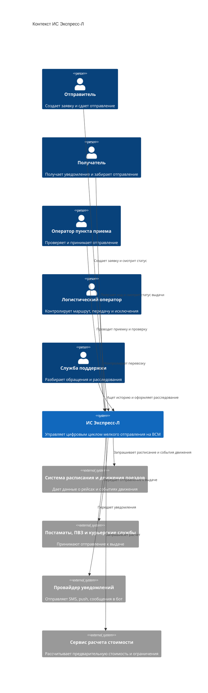

# 02. Контекст и границы

## Системный контекст

ИС "Экспресс-Л" находится между пользовательскими каналами, операторами перевозки и внешними системами железнодорожной и последней мили. Система отвечает за цифровой жизненный цикл отправления, но не управляет движением поездов, физической инфраструктурой вокзалов и юридическими отношениями с партнерами.

## Потоки через границу системы

| Откуда | Куда | Данные | Ответственность ИС |
|---|---|---|---|
| Отправитель | ИС | Параметры отправления, контакты, способ выдачи | Проверить, сохранить заявку, выдать номер |
| Пункт приема | ИС | Результат физической проверки | Обновить состояние и зафиксировать причину отказа |
| ИС | Система расписания | Запрос подходящего поезда | Получить варианты, выбрать маршрут по правилам MVP |
| Система движения | ИС | События отправления/прибытия | Применить событие идемпотентно и обновить статус |
| ИС | ПВЗ/постамат/курьер | Данные для выдачи | Передать только нужный минимум данных |
| ИС | Провайдер уведомлений | Текст и получатель уведомления | Отправить уведомление и сохранить факт попытки |

## Внутри границ MVP

- управление заявками и отправлениями;
- проверка статусов и переходов;
- хранение истории событий;
- очередь фоновых заданий;
- адаптеры внешних систем;
- панели операторов;
- механизмы расследования и компенсационного решения.

## Вне границ MVP

- управление реальным движением поездов;
- физическая сортировка на вокзалах;
- управление роботами-курьерами как устройствами;
- договорная работа с B2B-клиентами;
- расчет финансовой эффективности инфраструктуры;
- разработка промышленных API партнеров, если они еще не согласованы.

## Допущения

- Внешние системы в прототипе могут быть заменены заглушками с теми же контрактами.
- Для пилота используется одно направление: Москва - Санкт-Петербург.
- Постамат, ПВЗ и курьерская доставка представлены одной абстракцией "канал выдачи".

