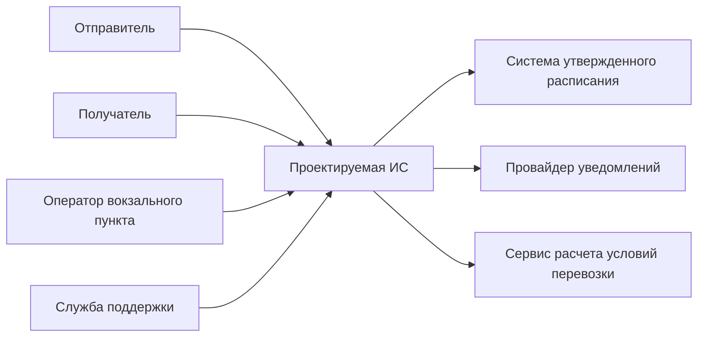

# 02. Контекст и границы

## Системный контекст

Проектируемая ИС находится между клиентскими каналами, вокзальными операторами и внешними сервисами, которые нужны для расписания, уведомлений и расчета условий перевозки. Система отвечает за цифровой жизненный цикл вокзального отправления, но не управляет движением поездов, не меняет расписание и не отвечает за физическую организацию вокзальной инфраструктуры.

Диаграмма намеренно показывает только внешние границы. Внутренние модули, базы, очереди и фоновые обработчики описываются в архитектурном разделе.

## Потоки через границу системы

| Откуда | Куда | Данные | Ответственность ИС |
|---|---|---|---|
| Отправитель | ИС | Параметры отправления, контакты, направление | Проверить данные, сохранить заявку, выдать номер отслеживания |
| Получатель | ИС | Запрос статуса, код или номер отправления | Показать разрешенную часть истории и статус выдачи |
| Оператор вокзального пункта | ИС | Результат приемки, причина отказа, фото несоответствия, факт выдачи | Обновить состояние и сохранить доказательную базу |
| ИС | Система расписания | Запрос ближайшего рейса по фиксированному направлению | Проверить ближайший рейс и время окончания приема; при необходимости выбрать следующий рейс |
| ИС | Провайдер уведомлений | Текст, адресат, тип уведомления | Отправить уведомление и сохранить факт попытки |
| ИС | Сервис расчета условий перевозки | Направление, габариты, вес, категория | Получить предварительные условия или причину отказа |

## Внутри границ MVP

- управление заявками и отправлениями;
- проверка статусов и переходов;
- назначение отправления на рейс по утвержденному расписанию;
- хранение истории событий;
- хранение фото отказа в приемке и материалов претензий;
- очередь фоновых заданий;
- адаптеры внешних систем расписания, уведомлений и расчета условий;
- панель вокзального оператора;
- претензионный контур для обращений после выдачи или при явном дефекте.

## Вне границ MVP

- управление движением поездов;
- изменение утвержденного расписания;
- проектирование физической вокзальной инфраструктуры;
- прием отправлений у пользователя на дому;
- курьерская доставка до вокзала или от вокзала;
- выдача через внешние ПВЗ и партнерские постаматы вне вокзала;
- договорная работа с B2B-клиентами;
- расчет финансовой эффективности инфраструктуры;
- разработка API внешних партнеров.

Фраза "разработка API внешних партнеров" означает, что проектируемая система не создает и не контролирует интерфейсы РЖД, логистических компаний или маркетплейсов. В MVP проектируются только собственные адаптеры и ожидаемые контракты интеграции; реальные промышленные API партнеров должны быть уточнены отдельно, если такие интеграции появятся после вокзального MVP.

## Допущения

- Для пилота используется одно направление: Москва - Санкт-Петербург и обратно.
- Отправления принимаются и выдаются только в вокзальных пунктах.
- Рейс назначается по ближайшему поезду, для которого еще открыт прием к погрузке.
- Внешние системы в прототипе могут быть заменены заглушками с теми же контрактами.

