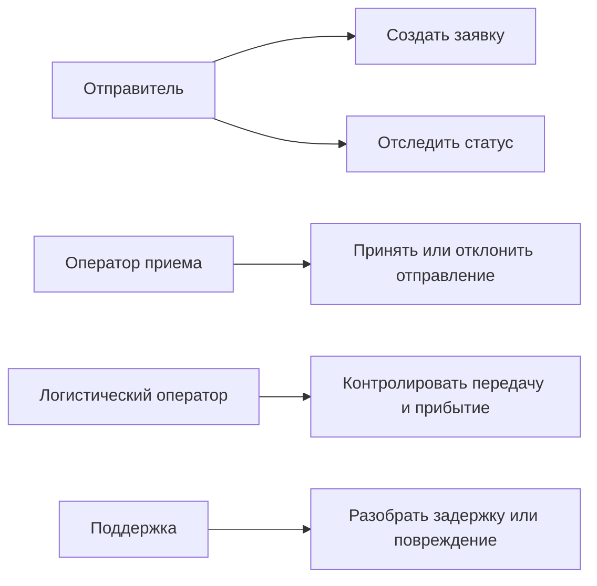

# 03. Требования

## Функциональные требования

| Код | Требование | Приоритет | Как проверить |
|---|---|---|---|
| FR-001 | Отправитель должен создать заявку с параметрами отправления, контактами и способом выдачи | Must | E2E-сценарий создания заявки |
| FR-002 | Система должна проверять обязательные поля, формат контактов, габариты и допустимый тип отправления | Must | Unit и API tests |
| FR-003 | После успешной заявки система должна перевести ее в ожидание сдачи в пункт приема | Must | Integration test статуса |
| FR-004 | Если отправление не сдано за 24 часа, заявка должна быть отменена автоматически | Must | Тест планировщика и времени |
| FR-005 | Оператор пункта приема должен принять или отклонить отправление с причиной | Must | E2E-сценарий приемки |
| FR-006 | Система должна подобрать ближайший допустимый поезд по расписанию и ограничениям | Must | Integration test с заглушкой расписания |
| FR-007 | Логистический оператор должен видеть отправления, ожидающие передачи в поезд | Must | UI/API test панели |
| FR-008 | Система должна фиксировать передачу отправления ЛНП или ответственному лицу поезда | Must | Integration test перехода статуса |
| FR-009 | Система должна принимать события прибытия и готовности к последней миле | Must | Contract test внешнего события |
| FR-010 | Система должна передавать отправление в постамат, ПВЗ или курьерскую службу | Must | Contract test адаптера выдачи |
| FR-011 | Система должна уведомлять отправителя и получателя о важных статусах | Should | Integration test уведомлений |
| FR-012 | При повреждении или несоответствии отправления система должна открыть расследование | Must | E2E-сценарий исключения |
| FR-013 | Служба поддержки должна видеть историю статусов и событий по отправлению | Must | API/UI test истории |
| FR-014 | Повторная команда или повторное внешнее событие не должны создавать дубли статусов | Must | Idempotency test |

## Нефункциональные требования

| Код | Требование | Приоритет | Как проверить |
|---|---|---|---|
| NFR-001 | Статусные события не должны теряться при перезапуске backend или worker | Must | Failure test с RabbitMQ и PostgreSQL |
| NFR-002 | API создания заявки должен отвечать без ожидания подбора поезда | Must | Нагрузочный тест и проверка асинхронного задания |
| NFR-003 | История отправления должна быть доступна оператору для расследования | Must | Проверка audit trail |
| NFR-004 | Доступ к отправлению должен ограничиваться владельцем или ролью оператора | Must | Security integration tests |
| NFR-005 | Система должна поддерживать горизонтальное масштабирование stateless-процессов | Should | Проверка deployment-схемы и обработки повторов |
| NFR-006 | Внешние интеграции должны быть заменяемыми без изменения доменной логики | Should | Contract tests адаптеров |
| NFR-007 | Для каждого запроса, задания и внешнего события должен использоваться correlation id | Should | Проверка логов и событий |

## Продуктовые правила MVP

| Правило | Значение | Где применяется | Как проверить |
|---|---|---|---|
| Окно сдачи | 24 часа после создания заявки | Планировщик отмены, статус заявки | Тест автоматической отмены |
| Направление | Москва - Санкт-Петербург и обратно | Расписание, расчет, проверка заявки | Unit и integration tests |
| Тип отправления | Мелкое отправление без опасных или запрещенных вложений | Валидация и физическая приемка | Unit и приемочный сценарий |
| Канал выдачи | Постамат, ПВЗ или курьер | Заявка, route plan, adapter last mile | Contract tests |
| История статусов | Не удаляется в рамках MVP | PostgreSQL, панель поддержки | Проверка аудита |

## Основные сценарии

## Ошибочные и альтернативные сценарии

| Ситуация | Поведение системы |
|---|---|
| Неверные данные заявки | Заявка не создается, пользователь получает список ошибок |
| Отправление не сдано за 24 часа | Заявка переводится в `cancelled_by_timeout`, уведомление отправляется отправителю |
| Проверка в пункте приема не пройдена | Отправление возвращается, заявка закрывается с причиной отказа |
| Подходящий поезд не найден | Отправление остается в ожидании маршрута, оператор видит проблему |
| Внешнее событие пришло повторно | Событие распознается по external event id и не применяется второй раз |
| Целостность нарушена | Открывается расследование, клиент уведомляется о задержке |
| Канал выдачи недоступен | Задание повторяется, затем передается оператору для ручного решения |

## Открытые вопросы

- Точные ограничения по весу, габаритам и запрещенным вложениям должны быть согласованы с правилами перевозчика.
- Точные SLA по скорости доставки должны быть подтверждены расписанием и операционной схемой ВСМ.
- Реальные API партнеров последней мили и расписания нужно заменить заглушками только на этапе прототипа.

