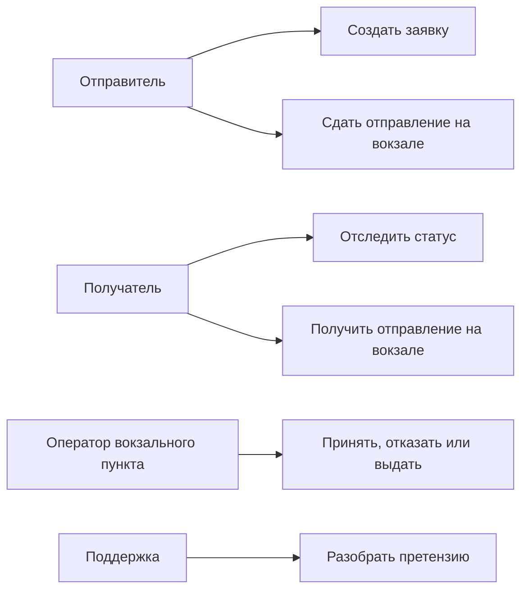

# 03. Требования

## Функциональные требования

| Код | Требование | Приоритет | Как проверить |
|---|---|---|---|
| FR-001 | Отправитель должен создать заявку с параметрами отправления, контактами, направлением и вокзальным пунктом сдачи | Must | E2E-сценарий создания заявки |
| FR-002 | Система должна проверять обязательные поля, формат контактов, габариты, вес и допустимый тип отправления | Must | Unit и API tests |
| FR-003 | После успешной заявки система должна перевести ее в ожидание сдачи в вокзальный пункт приема | Must | Integration test статуса |
| FR-004 | Если отправление не сдано за 24 часа, заявка должна быть отменена автоматически | Must | Тест планировщика и времени |
| FR-005 | Оператор вокзального пункта должен принять или отклонить отправление с причиной; при отказе обязательно прикладывается фото несоответствия | Must | E2E-сценарий приемки |
| FR-006 | Система должна назначить отправление на ближайший рейс по расписанию, если прием к погрузке еще открыт; иначе назначить следующий рейс | Must | Integration test с заглушкой расписания |
| FR-007 | Оператор должен видеть отправления, ожидающие передачи в поезд, прибытия и выдачи | Must | UI/API test панели |
| FR-008 | Система должна фиксировать передачу отправления ЛНП или ответственному лицу поезда | Must | Integration test перехода статуса |
| FR-009 | Система должна фиксировать прибытие рейса на станцию назначения и готовность отправления к вокзальной выдаче | Must | Integration test события прибытия |
| FR-010 | Оператор должен зафиксировать выдачу отправления получателю в вокзальном пункте выдачи | Must | E2E-сценарий выдачи |
| FR-011 | Система должна уведомлять отправителя и получателя о важных статусах | Should | Integration test уведомлений |
| FR-012 | Отправитель или получатель должен иметь возможность открыть претензию по повреждению, несоответствию или проблеме выдачи | Must | E2E-сценарий претензии |
| FR-013 | Служба поддержки должна видеть историю статусов, отказов, фото и претензий по отправлению | Must | API/UI test истории |
| FR-014 | Повторная команда или повторное внешнее событие не должны создавать дубли статусов | Must | Idempotency test |
| FR-015 | Если пользователь несколько раз за неделю не сдал оформленные отправления, система должна временно ограничить создание новых заявок | Should | Unit и integration tests правила ограничения |
| FR-016 | Получатель должен видеть историю статусов отправления в разрешенном объеме | Must | Security и API tests |

## Нефункциональные требования

| Код | Требование | Приоритет | Как проверить |
|---|---|---|---|
| NFR-001 | Статусные события не должны теряться при перезапуске backend или worker | Must | Failure test с RabbitMQ и PostgreSQL |
| NFR-002 | API создания заявки должен отвечать без ожидания обращения к внешним системам, если предварительные проверки можно выполнить локально | Must | Нагрузочный тест и проверка асинхронного задания |
| NFR-003 | История отправления должна быть доступна отправителю, получателю в ограниченном объеме, оператору и службе поддержки согласно ролям | Must | Проверка audit trail и прав доступа |
| NFR-004 | Доступ к отправлению должен ограничиваться владельцем, получателем по разрешенному идентификатору или ролью оператора | Must | Security integration tests |
| NFR-005 | Система должна поддерживать горизонтальное масштабирование stateless-процессов | Should | Проверка deployment-схемы и обработки повторов |
| NFR-006 | Внешние интеграции должны быть заменяемыми без изменения доменной логики | Should | Contract tests адаптеров |
| NFR-007 | Для каждого запроса, задания и внешнего события должен использоваться correlation id | Should | Проверка логов и событий |

## Продуктовые правила MVP

| Правило | Значение | Где применяется | Как проверить |
|---|---|---|---|
| Окно сдачи | 24 часа после создания заявки | Планировщик отмены, статус заявки | Тест автоматической отмены |
| Повторные несдачи | Несколько отмен по таймауту за неделю приводят к временному ограничению создания новых заявок | Заявка, профиль пользователя, антизлоупотребление | Unit и integration tests |
| Направление | Москва - Санкт-Петербург и обратно | Расписание, расчет, проверка заявки | Unit и integration tests |
| Назначение рейса | Ближайший рейс с открытым приемом к погрузке; если прием закрыт - следующий рейс | Расписание, план перевозки | Integration test |
| Тип отправления | Мелкое отправление без опасных или запрещенных вложений | Валидация и физическая приемка | Unit и приемочный сценарий |
| Канал выдачи | Только вокзальный пункт выдачи в MVP | Заявка, план перевозки, панель оператора | E2E-сценарий выдачи |
| История статусов | Не удаляется в рамках MVP | PostgreSQL, клиентский статус, панель поддержки | Проверка аудита |

## Основные сценарии

## Ошибочные и альтернативные сценарии

| Ситуация | Поведение системы |
|---|---|
| Неверные данные заявки | Заявка не создается, пользователь получает список ошибок |
| Отправление не сдано за 24 часа | Заявка переводится в `cancelled_by_timeout`, уведомление отправляется отправителю |
| Несколько несданных заявок за неделю | Пользователь получает временное ограничение на создание новых заявок |
| Проверка в пункте приема не пройдена | Отправление возвращается, заявка закрывается с причиной отказа и фото несоответствия |
| Прием к погрузке на ближайший рейс закрыт | Отправление назначается на следующий рейс по расписанию |
| Рейс отменен или расписание временно недоступно | Отправление остается в ожидании назначения, оператор видит проблему |
| Внешнее событие пришло повторно | Событие распознается по external event id и не применяется второй раз |
| Клиент обнаружил повреждение или несоответствие | Клиент открывает претензию, поддержка разбирает обращение по истории статусов и материалам |
| Получатель не может получить отправление | Оператор фиксирует проблему выдачи, поддержка открывает претензию или ручное разбирательство |

## Открытые вопросы

- Точные ограничения по весу, габаритам и запрещенным вложениям должны быть согласованы с правилами перевозчика.
- Нужно определить точное количество несданных заявок и срок временного ограничения.
- Нужно определить, какие фотографии отказа и претензий хранятся, кто имеет к ним доступ и сколько времени они доступны.
- Точные SLA по скорости доставки должны быть подтверждены расписанием и операционной схемой ВСМ.

