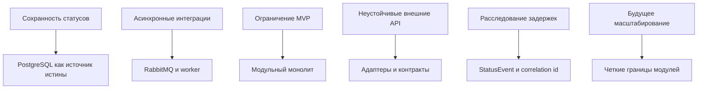

# 04. Архитектурные драйверы

## Ключевые драйверы

| Драйвер | Почему важен | Влияние на архитектуру | Как проверять |
|---|---|---|---|
| Сохранность статусов | Клиент и оператор должны видеть правдивую историю отправления | Источник истины в PostgreSQL, append-only status events | Integration и failure tests |
| Асинхронные интеграции | Расписание, уведомления и последняя миля могут отвечать с задержкой | RabbitMQ, worker, повторяемые задания | Тесты повторов и таймаутов |
| Простота MVP | Команда должна быстро сделать прототип и защитить архитектуру | Модульный монолит вместо набора микросервисов | Ревью границ модулей |
| Идемпотентность | Внешние события и сообщения могут приходить повторно | Idempotency keys, external event id, уникальные ограничения | Idempotency tests |
| Развитие до микросервисов | При росте нагрузки отдельные части могут потребовать выделения | Четкие модули и адаптеры | ADR и проверка зависимостей |
| Безопасность данных | Контакты отправителя и получателя нельзя раскрыть чужому пользователю | Ролевая модель, ownership checks, минимизация данных в адаптерах | Security tests |
| Операционная наблюдаемость | Задержки и повреждения требуют расследования | Correlation ids, audit trail, доменные события, панели | Проверка логов и метрик |

## Главные компромиссы

| Решение | Выигрыш | Цена |
|---|---|---|
| Модульный монолит | Быстрая разработка, проще отладка, меньше эксплуатационной сложности | Нужна дисциплина границ модулей |
| PostgreSQL как источник истины | Транзакционность, понятная модель статусов, надежный аудит | Часть событийной модели придется проектировать явно |
| RabbitMQ для заданий | Повторы, backpressure, асинхронность внешних вызовов | Нужно проектировать идемпотентность worker |
| Внешние адаптеры с заглушками | Можно развивать прототип без ожидания реальных API | Контракты нужно позже согласовать с партнерами |

## Карта влияния

## Решения, требующие ADR

- архитектурный стиль MVP;
- выбор PostgreSQL и RabbitMQ;
- модель статусов как доменные события;
- подключение внешних систем через адаптеры;
- перенос микросервисов и B2B-грузов в развитие.

