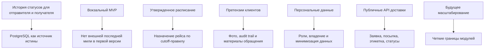

# 04. Архитектурные драйверы

## Ключевые драйверы

| Драйвер | Почему важен | Влияние на архитектуру | Как проверять |
|---|---|---|---|
| Сохранность статусов | Отправитель, получатель, оператор и поддержка должны видеть правдивую историю отправления в рамках своих прав | Источник истины в PostgreSQL, append-only status events, ролевая выдача истории | Integration, security и failure tests |
| Вокзальный MVP | Первая версия должна быть простой и проверяемой без сложной последней мили | Нет внешних ПВЗ и курьерки в MVP; есть вокзальная приемка, рейс и вокзальная выдача | Проверка границ сценариев и требований |
| Работа по утвержденному расписанию | Система не управляет движением поездов и не строит маршрут по сети | Назначение ближайшего рейса по cutoff-правилу, адаптер расписания | Integration test с заглушкой расписания |
| Простота MVP | Команда должна быстро сделать прототип и защитить архитектуру | Модульный монолит вместо набора микросервисов | Ревью границ модулей |
| Идемпотентность | Внешние события и сообщения могут приходить повторно | Idempotency keys, external event id, уникальные ограничения | Idempotency tests |
| Претензионный контур | Повреждение или несоответствие чаще выявляет клиент или оператор, а не система автоматически | Отдельная сущность претензии, фото и audit trail без блокировки обычной выдачи без причины | E2E-сценарии претензий |
| Безопасность данных | Контакты отправителя и получателя, фото и история отправления нельзя раскрыть чужому пользователю | Ролевая модель, ownership checks, минимизация данных, учет законодательства РФ о персональных данных | Security tests и ревью требований |
| Операционная наблюдаемость | Отказы в приемке, задержки рейса, несданные заявки и претензии требуют разбирательства | Correlation ids, audit trail, доменные события, панели | Проверка логов и метрик |
| Ориентация на практики популярных сервисов | Модель не должна изобретаться с нуля | Разделены заявка, физическая посылка, этикетка, статусы и материалы проверки; ориентир - публичная документация [Wildberries FBS Orders API](https://dev.wildberries.ru/en/docs/openapi/orders-fbs) | Архитектурное ревью модели данных |

## Главные компромиссы

| Решение | Выигрыш | Цена |
|---|---|---|
| Вокзальный MVP без внешней последней мили | Меньше интеграций, проще защита и пилот | Пользователю нужно самостоятельно принести и забрать отправление на вокзале |
| Модульный монолит | Быстрая разработка, проще отладка, меньше эксплуатационной сложности | Нужна дисциплина границ модулей |
| PostgreSQL как источник истины | Транзакционность, понятная модель статусов, надежный аудит | Часть событийной модели придется проектировать явно |
| RabbitMQ для заданий | Повторы, backpressure, асинхронность уведомлений и операций по времени | Нужно проектировать идемпотентность worker |
| Внешние адаптеры с заглушками | Можно развивать прототип без ожидания реальных API | Контракты нужно позже согласовать с владельцами внешних систем |

## Карта влияния

## Решения, требующие ADR

- архитектурный стиль MVP;
- выбор PostgreSQL и RabbitMQ;
- модель статусов как доменные события;
- подключение внешних систем через адаптеры;
- вокзальный MVP без внешних ПВЗ и курьерской доставки;
- перенос микросервисов, B2B-грузов и последней мили в развитие.
