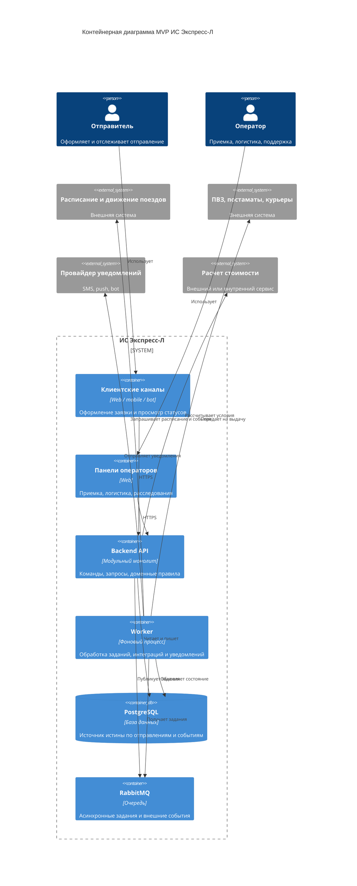
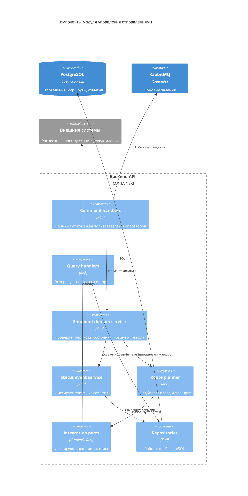

# 05. Архитектура

## Архитектурный стиль

MVP строится как модульный монолит: один backend-код с четкими внутренними модулями, общая база данных, отдельные фоновые обработчики и очередь заданий. Это снижает сложность первой версии, но сохраняет возможность позже выделить отдельные модули в сервисы.

## Контейнерная диаграмма

## Основные модули backend

| Модуль | Ответственность |
|---|---|
| Identity and Access | Пользователи, роли, проверка владения отправлениями |
| Shipment Application | Создание и валидация заявок |
| Parcel Acceptance | Приемка, физическая проверка, отказ с причиной |
| Routing | Подбор поезда, формирование route plan |
| Shipment Tracking | Статусы, доменные события, история |
| Last Mile | Передача в постамат, ПВЗ или курьерскую службу |
| Notifications | Шаблоны и отправка уведомлений |
| Investigation | Повреждения, задержки, расследования, компенсационное решение |
| Integration Adapters | Контракты и адаптеры внешних систем |

## Компонентная диаграмма ключевого модуля

Ключевым считается модуль управления отправлениями, потому что он связывает заявку, посылку, маршрут, статусы и исключения.

## Правила зависимостей

- Доменная логика не зависит от конкретных API внешних систем.
- Команды меняют состояние только через domain service.
- Текущее состояние отправления хранится в таблице отправлений, а история - в status events.
- Worker может повторно выполнить задание без повреждения состояния.
- Панели операторов используют тот же API, что и клиентские каналы, но с другими правами.
- Адаптеры внешних систем не должны писать в базу напрямую, только через прикладные команды.

## Ключевые политики

| Политика | Где реализуется | Почему здесь | Как проверить |
|---|---|---|---|
| Проверка владельца отправления | Backend API и domain service | Все пользовательские операции проходят через API | Security tests |
| Валидация переходов статусов | Shipment domain service | Статус нельзя менять произвольно | Unit tests state machine |
| Автоматическая отмена через 24 часа | Worker и domain service | Зависит от времени и состояния | Integration test планировщика |
| Идемпотентность внешних событий | Status event service и PostgreSQL | Повтор события не должен менять историю дважды | Idempotency tests |
| Повторы внешних вызовов | Worker | Сетевые сбои не должны ломать процесс | Failure tests |

## ADR

Решения по архитектурному стилю, хранилищам, статусной модели, адаптерам и границам MVP вынесены в каталог [adr](adr/README.md).

