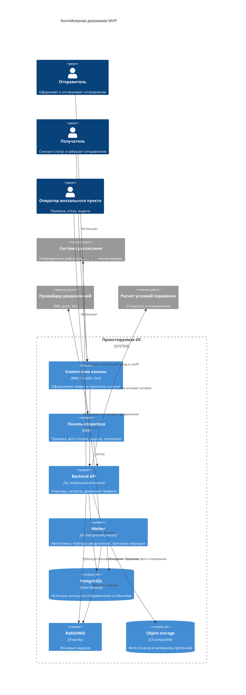
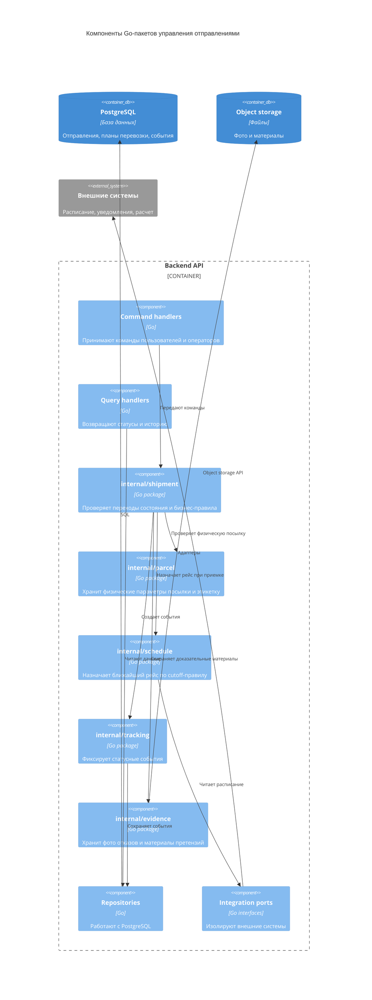

# 05. Архитектура

## Архитектурный стиль

MVP строится как модульный монолит на Go: один backend-код с четкими внутренними пакетами, общая база данных, отдельный фоновый процесс для отложенных задач и очередь сообщений. Пакеты внутри backend не являются микросервисами и не разворачиваются отдельно. Они нужны, чтобы разделить ответственность в коде и не смешивать приемку, расписание, статусы, уведомления и претензии.

В первой версии система поддерживает полностью вокзальный процесс: оформление заявки, сдача в пункт приема на вокзале, назначение рейса по расписанию, передача в поезд, прибытие на вокзал назначения и выдача получателю в вокзальном пункте.

## Backend и worker

`Backend API` - основное Go-приложение, которое принимает команды пользователей и операторов. В штатном сценарии приемки именно Backend API проверяет расписание, cutoff приема к погрузке и сразу сохраняет назначенный рейс.

`Worker` - не отдельный бизнес-сервис, а фоновый процесс из того же кодового репозитория. Он нужен для задач, которые не должны зависеть от пользовательского запроса:

- автоматическая отмена заявок, не сданных за 24 часа;
- временное ограничение пользователя за повторные несданные заявки;
- повтор неуспешных уведомлений;
- очистка временных файлов и технические фоновые операции.

Worker не выбирает рейс в обычном сценарии приемки. Назначение рейса выполняется синхронно в Backend API, потому что оператору сразу нужно понимать, на какой поезд принято отправление.

## Контейнерная диаграмма

## Go-пакеты backend

| Пакет | Ответственность |
|---|---|
| `internal/identity` | Пользователи, роли, временные ограничения, проверка владения отправлениями |
| `internal/shipment` | Заявки, отправления, переходы состояния, доменные правила |
| `internal/parcel` | Физическая посылка, габариты, вес, упаковка, этикетка, проверка ограничений |
| `internal/station` | Вокзальная приемка, отказ с причиной и фото, выдача |
| `internal/schedule` | Чтение расписания, cutoff-правило, назначение ближайшего доступного рейса |
| `internal/tracking` | История статусов и представления для отправителя, получателя и оператора |
| `internal/notifications` | Шаблоны и отправка уведомлений |
| `internal/claims` | Претензии клиентов, материалы, решения поддержки |
| `internal/integrations` | Адаптеры расписания, уведомлений и расчета условий |
| `internal/evidence` | Фото отказов, материалы претензий, metadata файлов |

## Компонентная диаграмма ключевого пакета

Ключевым считается пакет управления отправлениями, потому что он связывает заявку, физическую посылку, проверку, назначение рейса, статусы, выдачу и претензии.

## Правила зависимостей

- Пакеты внутри Backend API не являются отдельными сервисами.
- Доменная логика не зависит от конкретных API внешних систем.
- Команды меняют состояние только через пакет `internal/shipment`.
- Текущее состояние отправления хранится в таблице отправлений, а история - в status events.
- Назначение рейса при приемке выполняет Backend API через пакет `internal/schedule`.
- Worker может повторно выполнить фоновое задание без повреждения состояния.
- Панель оператора использует тот же API, что и клиентские каналы, но с другими правами.
- Адаптеры внешних систем не должны писать в базу напрямую, только через прикладные команды.
- Фото отказа и материалы претензии хранятся отдельно от основной транзакционной модели, а в PostgreSQL сохраняются ссылки и metadata.

## Ключевые политики

| Политика | Где реализуется | Почему здесь | Как проверить |
|---|---|---|---|
| Проверка владельца отправления | Backend API и `internal/shipment` | Все пользовательские операции проходят через API | Security tests |
| Валидация переходов статусов | `internal/shipment` | Статус нельзя менять произвольно | Unit tests state machine |
| Проверка физической посылки | `internal/parcel` и `internal/station` | Оператор проверяет именно посылку, а не абстрактную заявку | Unit и E2E tests |
| Автоматическая отмена через 24 часа | Worker и `internal/shipment` | Зависит от времени и состояния | Integration test планировщика |
| Временное ограничение за повторные несдачи | `internal/identity` и `internal/shipment` | Правило зависит от истории заявок пользователя | Unit и integration tests |
| Назначение ближайшего рейса | Backend API и `internal/schedule` | Направление фиксировано, выбирается только поезд с открытым приемом | Integration test расписания |
| Идемпотентность внешних событий | `internal/tracking` и PostgreSQL | Повтор события не должен менять историю дважды | Idempotency tests |
| Претензии клиентов | `internal/claims` и `internal/evidence` | Претензия не должна ломать основной поток выдачи без явной причины | E2E-сценарии претензий |

## ADR

Решения по архитектурному стилю, хранилищам, статусной модели, адаптерам и границам MVP вынесены в каталог [adr](adr/README.md).
