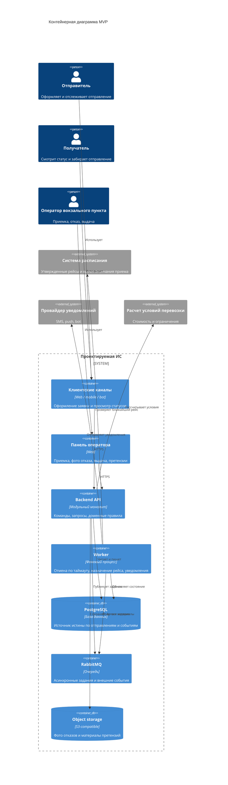
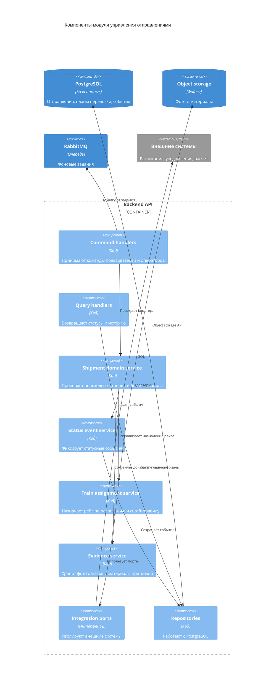

# 05. Архитектура

## Архитектурный стиль

MVP строится как модульный монолит: один backend-код с четкими внутренними модулями, общая база данных, отдельные фоновые обработчики и очередь заданий. Это снижает сложность первой версии, но сохраняет возможность позже выделить отдельные модули в сервисы.

В первой версии система поддерживает полностью вокзальный процесс: оформление заявки, сдача в пункт приема на вокзале, назначение рейса по расписанию, передача в поезд, прибытие на вокзал назначения и выдача получателю в вокзальном пункте.

## Контейнерная диаграмма

## Основные модули backend

| Модуль | Ответственность |
|---|---|
| Identity and Access | Пользователи, роли, проверка владения отправлениями |
| Shipment Application | Создание и валидация заявок |
| Station Acceptance | Вокзальная приемка, физическая проверка, отказ с причиной и фото |
| Train Assignment | Назначение ближайшего рейса по расписанию и cutoff-правилу |
| Shipment Tracking | Статусы, доменные события, история для отправителя и получателя |
| Station Handoff | Передача в поезд, прибытие и вокзальная выдача |
| Notifications | Шаблоны и отправка уведомлений |
| Claims | Претензии клиентов, материалы, решения поддержки |
| Integration Adapters | Контракты и адаптеры расписания, уведомлений и расчета условий |

## Компонентная диаграмма ключевого модуля

Ключевым считается модуль управления отправлениями, потому что он связывает заявку, проверку, назначение рейса, статусы, выдачу и претензии.

## Правила зависимостей

- Доменная логика не зависит от конкретных API внешних систем.
- Команды меняют состояние только через domain service.
- Текущее состояние отправления хранится в таблице отправлений, а история - в status events.
- Worker может повторно выполнить задание без повреждения состояния.
- Панель оператора использует тот же API, что и клиентские каналы, но с другими правами.
- Адаптеры внешних систем не должны писать в базу напрямую, только через прикладные команды.
- Фото отказа и материалы претензии хранятся отдельно от основной транзакционной модели, а в PostgreSQL сохраняются ссылки и metadata.

## Ключевые политики

| Политика | Где реализуется | Почему здесь | Как проверить |
|---|---|---|---|
| Проверка владельца отправления | Backend API и domain service | Все пользовательские операции проходят через API | Security tests |
| Валидация переходов статусов | Shipment domain service | Статус нельзя менять произвольно | Unit tests state machine |
| Автоматическая отмена через 24 часа | Worker и domain service | Зависит от времени и состояния | Integration test планировщика |
| Временное ограничение за повторные несдачи | Shipment Application и Identity | Правило зависит от истории заявок пользователя | Unit и integration tests |
| Назначение ближайшего рейса | Train Assignment | Направление фиксировано, выбирается только рейс с открытым приемом | Integration test расписания |
| Идемпотентность внешних событий | Status event service и PostgreSQL | Повтор события не должен менять историю дважды | Idempotency tests |
| Претензии клиентов | Claims и Evidence service | Претензия не должна ломать основной поток выдачи без явной причины | E2E-сценарии претензий |

## ADR

Решения по архитектурному стилю, хранилищам, статусной модели, адаптерам и границам MVP вынесены в каталог [adr](adr/README.md).

