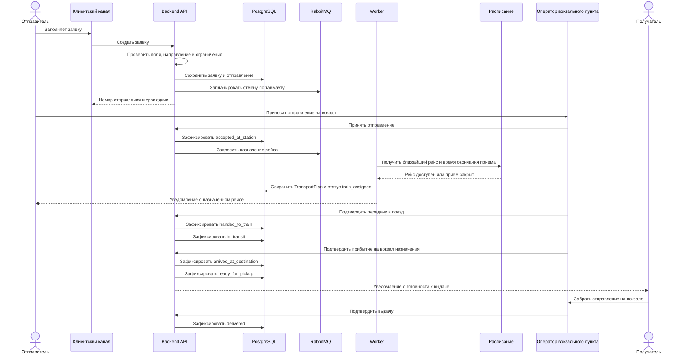
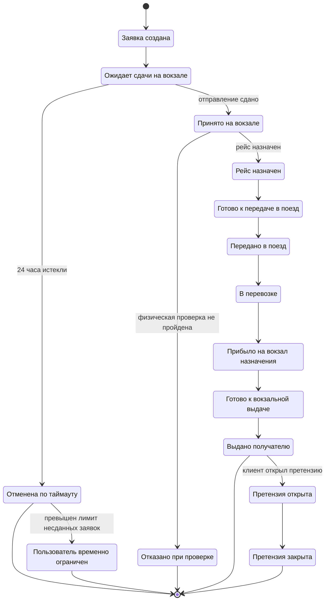

# 06. Сценарии и потоки

## Сквозной сценарий: от заявки до вокзальной выдачи

## Жизненный цикл отправления

## Справочник статусов

| Статус | Смысл | Кто или что переводит |
|---|---|---|
| `created` | Заявка создана и прошла первичную проверку формы | Backend API |
| `awaiting_dropoff` | Система ожидает сдачи отправления в вокзальный пункт приема | Backend API |
| `cancelled_by_timeout` | Отправление не сдано за 24 часа | Worker |
| `user_temporarily_limited` | Пользователь временно ограничен из-за повторных несданных заявок | Identity / Shipment Application |
| `accepted_at_station` | Отправление принято на вокзале после физической проверки | Оператор вокзального пункта |
| `rejected_at_check` | Проверка не пройдена, перевозка отклонена | Оператор вокзального пункта |
| `train_assigned` | Назначен рейс по утвержденному расписанию | Worker |
| `ready_for_train_handoff` | Отправление подготовлено к передаче в поезд | Оператор вокзального пункта |
| `handed_to_train` | Отправление передано ЛНП или ответственному лицу поезда | Оператор вокзального пункта |
| `in_transit` | Отправление находится в перевозке | Оператор или событие рейса |
| `arrived_at_destination` | Отправление прибыло на вокзал назначения | Оператор вокзального пункта |
| `ready_for_pickup` | Получатель может забрать отправление на вокзале | Оператор вокзального пункта |
| `delivered` | Отправление выдано получателю | Оператор вокзального пункта |
| `claim_opened` | Клиент открыл претензию по повреждению, несоответствию или выдаче | Отправитель, получатель или поддержка |
| `claim_closed` | Претензия закрыта решением поддержки | Служба поддержки |

## Поток автоматической отмены

1. При создании заявки система сохраняет `dropoff_deadline`.
2. Worker периодически ищет заявки в статусе `awaiting_dropoff` с истекшим сроком.
3. Для каждой найденной заявки выполняется команда `CancelExpiredShipmentRequest`.
4. Domain service проверяет, что отправление еще не принято.
5. Система сохраняет статус `cancelled_by_timeout` и отправляет уведомление отправителю.
6. Если у пользователя накопилось несколько таких отмен за неделю, система временно ограничивает создание новых заявок.

## Поток отказа в приемке

1. Оператор проверяет отправление на вокзале.
2. Если отправление не соответствует правилам, оператор выбирает причину отказа.
3. Оператор прикладывает фото, на котором видно несоответствие требованиям.
4. Система сохраняет `CheckResult`, ссылку на фото и статус `rejected_at_check`.
5. Отправитель получает уведомление с причиной отказа.

## Поток претензии клиента

1. Отправитель или получатель открывает претензию по номеру отправления.
2. Система проверяет право доступа к отправлению.
3. Клиент выбирает причину: повреждение, несоответствие, проблема выдачи или другое.
4. Клиент может приложить фото или описание.
5. Служба поддержки видит историю статусов, фото отказов, материалы претензии и принимает решение.
6. После решения претензия закрывается, а клиент получает уведомление.

## Правила повторов и идемпотентности

| Событие или команда | Ключ идемпотентности | Правило |
|---|---|---|
| Создание заявки | client_request_id | Повтор возвращает уже созданную заявку |
| Назначение рейса | shipment_id + schedule_version | Повтор не создает второй план перевозки |
| Внешнее событие расписания | external_event_id + provider | Повторное событие не применяется второй раз |
| Фото отказа | check_result_id + file_hash | Повтор не создает дубликат материала |
| Уведомление | notification_type + shipment_id + status | Повтор допускается только после неуспешной попытки |
| Отмена по таймауту | shipment_id + target_status | Не применяется, если отправление уже принято |
| Открытие претензии | shipment_id + claimant_id + reason + created_period | Повторный запрос возвращает текущую открытую претензию |
