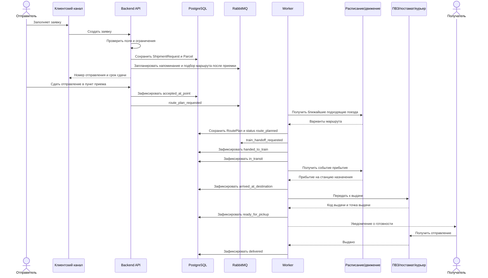
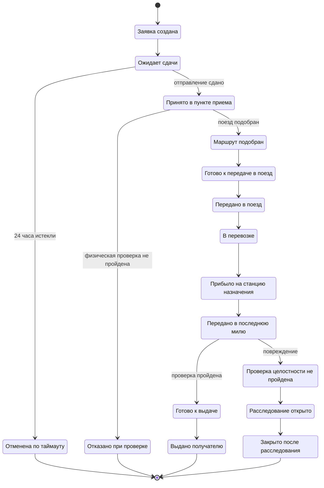

# 06. Сценарии и потоки

## Сквозной сценарий: от заявки до выдачи

## Жизненный цикл отправления

## Справочник статусов

| Статус | Смысл | Кто или что переводит |
|---|---|---|
| `created` | Заявка создана и прошла первичную проверку формы | Backend API |
| `awaiting_dropoff` | Система ожидает сдачи отправления в пункт приема | Backend API |
| `cancelled_by_timeout` | Отправление не сдано за 24 часа | Worker |
| `accepted_at_point` | Отправление принято после физической проверки | Оператор приема |
| `rejected_at_check` | Проверка не пройдена, перевозка отклонена | Оператор приема |
| `route_planned` | Подобран поезд и сформирован маршрут | Worker |
| `ready_for_train_handoff` | Отправление подготовлено к передаче в поезд | Логистический оператор или worker |
| `handed_to_train` | Отправление передано ЛНП или ответственному лицу поезда | Логистический оператор |
| `in_transit` | Отправление находится в перевозке | Worker по событию движения |
| `arrived_at_destination` | Отправление прибыло на станцию назначения | Worker по событию движения |
| `handed_to_last_mile` | Отправление передано в постамат, ПВЗ или курьерскую службу | Worker |
| `ready_for_pickup` | Получатель может забрать отправление | Внешняя система последней мили |
| `integrity_check_failed` | Целостность нарушена или есть расхождение | Оператор или внешняя система |
| `investigation_opened` | Открыто служебное расследование | Служба поддержки |
| `delivered` | Отправление выдано получателю | Внешняя система последней мили |
| `closed_after_investigation` | Расследование закрыто решением оператора | Служба поддержки |

## Поток автоматической отмены

1. При создании заявки система сохраняет `dropoff_deadline`.
2. Worker периодически ищет заявки в статусе `awaiting_dropoff` с истекшим сроком.
3. Для каждой найденной заявки выполняется команда `CancelExpiredShipmentRequest`.
4. Domain service проверяет, что отправление еще не принято.
5. Система сохраняет статус `cancelled_by_timeout` и отправляет уведомление отправителю.

## Поток повреждения или задержки

1. Оператор или внешняя система фиксирует проблему.
2. Система проверяет, что отправление еще не закрыто.
3. Создается `InvestigationCase`.
4. Статус переводится в `investigation_opened`.
5. Отправителю и получателю отправляется уведомление о задержке.
6. После решения оператор фиксирует компенсационное решение и закрывает расследование.

## Правила повторов и идемпотентности

| Событие или команда | Ключ идемпотентности | Правило |
|---|---|---|
| Создание заявки | client_request_id | Повтор возвращает уже созданную заявку |
| Внешнее событие движения | external_event_id + provider | Повторное событие не применяется второй раз |
| Уведомление | notification_type + shipment_id + status | Повтор допускается только после неуспешной попытки |
| Передача в последнюю милю | handoff_id | Повтор не создает вторую заявку у партнера |
| Отмена по таймауту | shipment_id + target_status | Не применяется, если отправление уже принято |
