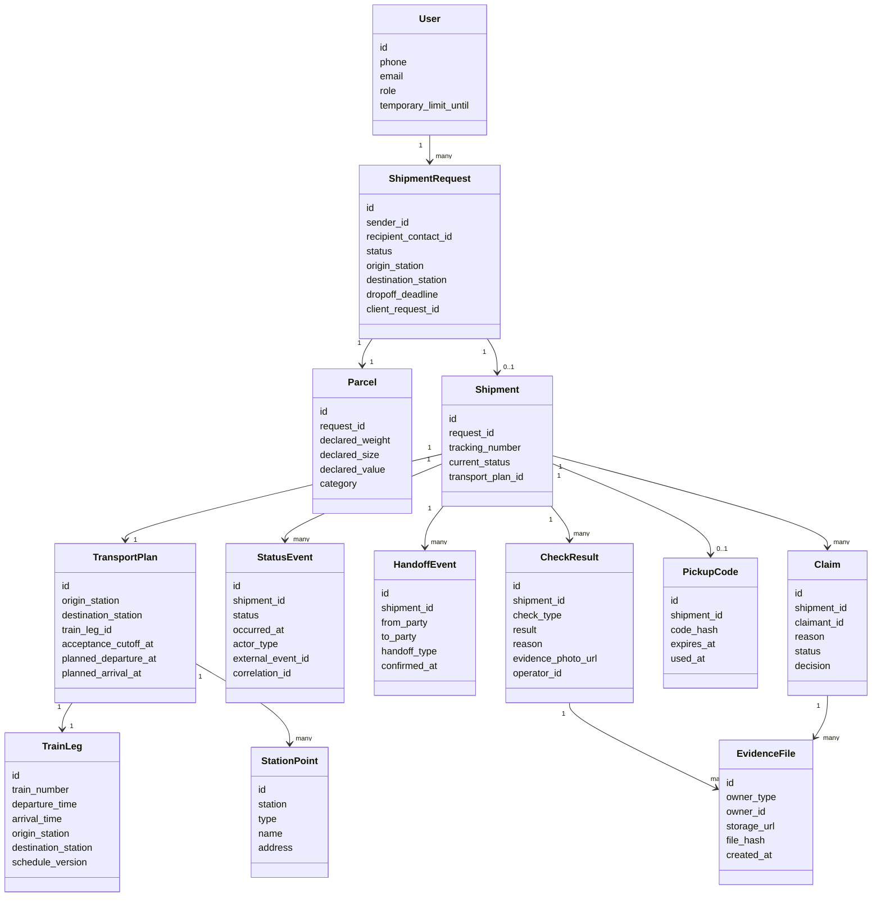

# 07. Данные и хранилища

## Источник истины

PostgreSQL является источником истины для заявок, отправлений, планов перевозки, статусных событий, проверок, выдачи и претензий. RabbitMQ хранит только временные задания и сообщения, которые можно восстановить из состояния базы.

Фото отказов и материалы претензий хранятся в object storage, а в PostgreSQL сохраняются ссылки, metadata, права доступа и связь с отправлением.

## Основные сущности

## Назначение хранилищ

| Хранилище | Что хранит | Почему |
|---|---|---|
| PostgreSQL | Состояние отправлений, заявки, события, планы перевозки, претензии | Нужны транзакции, ограничения и audit trail |
| RabbitMQ | Задания worker, события для уведомлений, повторы интеграций | Нужна асинхронность и backpressure |
| Object storage | Фото отказов, фото претензий, сканы актов | Крупные файлы не стоит хранить в базе |
| Хранилище логов | Технические логи с correlation ids | Разбор инцидентов |

## Правила хранения

| Данные | Источник истины | Срок хранения MVP | Удаление или восстановление |
|---|---|---|---|
| ShipmentRequest и Shipment | PostgreSQL | Постоянно в рамках MVP | Восстановление из резервной копии |
| StatusEvent | PostgreSQL | Постоянно в рамках MVP | Не удаляется, только дополняется |
| External event id | PostgreSQL | Вместе со status event | Нужен для защиты от повторов |
| PickupCode | PostgreSQL | До выдачи и окончания срока кода | Хранится hash, не открытый код |
| Фото отказа | Object storage + metadata в PostgreSQL | До окончания срока аудита | Metadata остается в PostgreSQL |
| Материалы претензии | Object storage + metadata в PostgreSQL | До закрытия и срока аудита | Metadata остается в PostgreSQL |
| Сообщения RabbitMQ | RabbitMQ | До успешной обработки | Можно пересоздать по состоянию БД |

## Миграции и совместимость

- Схема БД меняется через миграции.
- Новые статусы добавляются без удаления старых.
- Внешние события версионируются полем `schema_version`.
- Для важных внешних идентификаторов используются уникальные ограничения.
- Данные пользователя и материалы с персональными данными должны храниться с учетом требований законодательства РФ о персональных данных.
- Удаление данных пользователя в MVP не проектируется как публичная функция, но чувствительные данные отделяются от истории статусов.

## Данные для аудита

Каждое статусное событие должно хранить:

- `shipment_id`;
- новый статус;
- время события;
- источник события;
- идентификатор пользователя, оператора или внешней системы;
- `correlation_id`;
- `external_event_id`, если событие пришло извне;
- причину отказа или претензии, если применимо.

