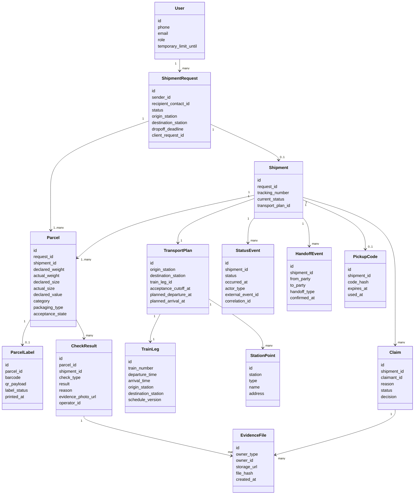

# 07. Данные и хранилища

## Источник истины

PostgreSQL является источником истины для заявок, физических посылок, отправлений, планов перевозки, статусных событий, проверок, выдачи и претензий. RabbitMQ хранит только временные задания и сообщения, которые можно восстановить из состояния базы.

Фото отказов и материалы претензий хранятся в object storage, а в PostgreSQL сохраняются ссылки, metadata, права доступа и связь с отправлением или физической посылкой.

## Ориентиры из публичной документации популярных сервисов

Модель данных не должна изобретаться с нуля. В качестве ориентира используется публичная документация популярных логистических и торговых платформ. В текущей итерации проверенным ориентиром является официальная документация [Wildberries FBS Orders API](https://dev.wildberries.ru/en/docs/openapi/orders-fbs): в ней отдельно описаны сборочные задания, статусы, metadata, поставки, стикеры/этикетки и пропуска.

Из этого для MVP берутся следующие принципы:

- отделять намерение клиента оформить перевозку от физической посылки;
- хранить статус процесса отдельно от физических параметров посылки;
- иметь отдельную сущность этикетки или штрихкода;
- фиксировать результаты проверки физической посылки отдельно от заявки;
- хранить историю статусов как отдельные события.

Документацию Ozon и СДЭК стоит дополнительно сверить на следующей итерации, когда их публичные API-документы будут стабильно доступны из окружения.

## Почему Parcel нужна отдельно

`ShipmentRequest` описывает намерение клиента: кто отправляет, куда, кому и в какой срок нужно сдать отправление. `Parcel` описывает физическую посылку: вес, габариты, категорию, упаковку, штрихкод и результат проверки. Это разные вещи:

- заявка может быть создана, но посылка еще не сдана;
- оператор проверяет именно физическую посылку, а не заявку;
- отказ в приемке должен ссылаться на посылку и фото несоответствия;
- этикетка или штрихкод печатается для посылки;
- в будущем одна заявка может включать несколько мест, даже если MVP начинает с одной посылки.

В MVP можно ограничить одну заявку одной посылкой, но модель оставляет возможность расширения до нескольких мест без ломки основных сущностей.

## Основные сущности

## Назначение хранилищ

| Хранилище | Что хранит | Почему |
|---|---|---|
| PostgreSQL | Состояние заявок, посылок, отправлений, события, планы перевозки, претензии | Нужны транзакции, ограничения и audit trail |
| RabbitMQ | Фоновые задания worker, события для уведомлений, повторы интеграций | Нужна асинхронность для задач вне пользовательского запроса |
| Object storage | Фото отказов, фото претензий, сканы актов | Крупные файлы не стоит хранить в базе |
| Хранилище логов | Технические логи с correlation ids | Разбор инцидентов |

## Правила хранения

| Данные | Источник истины | Срок хранения MVP | Удаление или восстановление |
|---|---|---|---|
| ShipmentRequest, Parcel и Shipment | PostgreSQL | Постоянно в рамках MVP | Восстановление из резервной копии |
| ParcelLabel | PostgreSQL | Вместе с посылкой | Можно переиздать с новым статусом этикетки |
| StatusEvent | PostgreSQL | Постоянно в рамках MVP | Не удаляется, только дополняется |
| External event id | PostgreSQL | Вместе со status event | Нужен для защиты от повторов |
| PickupCode | PostgreSQL | До выдачи и окончания срока кода | Хранится hash, не открытый код |
| Фото отказа | Object storage + metadata в PostgreSQL | До окончания срока аудита | Metadata остается в PostgreSQL |
| Материалы претензии | Object storage + metadata в PostgreSQL | До закрытия и срока аудита | Metadata остается в PostgreSQL |
| Сообщения RabbitMQ | RabbitMQ | До успешной обработки | Можно пересоздать по состоянию БД |

## Миграции и совместимость

- Схема БД меняется через миграции.
- Новые статусы добавляются без удаления старых.
- Внешние события версионируются полем `schema_version`.
- Для важных внешних идентификаторов используются уникальные ограничения.
- Данные пользователя и материалы с персональными данными должны храниться с учетом требований законодательства РФ о персональных данных.
- Удаление данных пользователя в MVP не проектируется как публичная функция, но чувствительные данные отделяются от истории статусов.

## Данные для аудита

Каждое статусное событие должно хранить:

- `shipment_id`;
- новый статус;
- время события;
- источник события;
- идентификатор пользователя, оператора или внешней системы;
- `correlation_id`;
- `external_event_id`, если событие пришло извне;
- причину отказа или претензии, если применимо.

Каждый результат проверки посылки должен хранить:

- `parcel_id`;
- `shipment_id`, если отправление уже создано;
- тип проверки;
- результат;
- причину отказа или замечания;
- ссылку на фото несоответствия;
- идентификатор оператора;
- время проверки.

