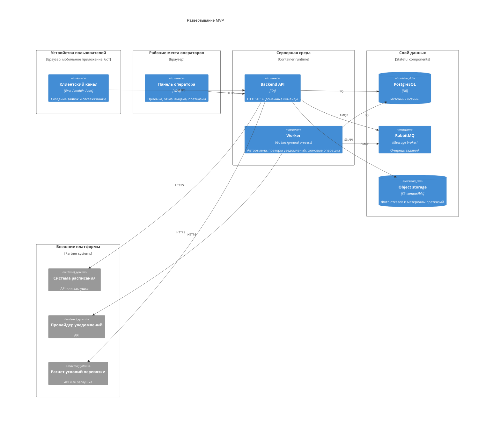

# 08. Развертывание

## Целевая среда MVP

MVP можно развернуть в контейнерной среде: один или несколько экземпляров Backend API, один или несколько worker-процессов, PostgreSQL, RabbitMQ, object storage и наблюдаемость. Для учебного прототипа допустим запуск через Docker Compose; для пилота - Kubernetes или управляемая контейнерная платформа.

## Диаграмма развертывания

## Развертываемые процессы

| Процесс | Stateful | Масштабирование | Назначение |
|---|---|---|---|
| Backend API | Нет | Горизонтально | Принимает команды, проверяет права, читает статусы |
| Worker | Нет | Горизонтально | Обрабатывает очередь, уведомления, отмену по таймауту и технические фоновые операции |
| PostgreSQL | Да | Вертикально или managed HA | Источник истины |
| RabbitMQ | Да | Кластер или managed broker | Надежная доставка заданий |
| Object storage | Да | Managed или совместимое хранилище | Фото отказов и материалы претензий |

## Конфигурация и секреты

Секреты не хранятся в репозитории. Для MVP нужны:

- строка подключения к PostgreSQL;
- адрес и учетные данные RabbitMQ;
- ключи внешних API расписания, уведомлений и расчета;
- секрет подписи webhook или внешних событий, если они используются;
- ключи доступа к object storage;
- настройки TTL и retry policy;
- настройки временного ограничения за повторные несданные заявки.

## Окружения

| Окружение | Назначение | Отличия |
|---|---|---|
| Local | Разработка и демонстрация | Docker Compose, заглушки внешних систем |
| Test | Интеграционные и контрактные проверки | Изолированные БД и очередь, fake API расписания и уведомлений |
| Pilot | Ограниченная эксплуатация | Реальные или согласованные тестовые API расписания, наблюдаемость |

## Обновления без потери заданий

- API должен завершать текущие запросы при остановке, а worker - корректно завершать текущие фоновые задания.
- Worker подтверждает сообщение RabbitMQ только после успешного сохранения результата в PostgreSQL.
- При повторной доставке сообщения пакет `internal/shipment` проверяет текущее состояние и не применяет переход повторно.
- Миграции БД выполняются до запуска новой версии приложения.
