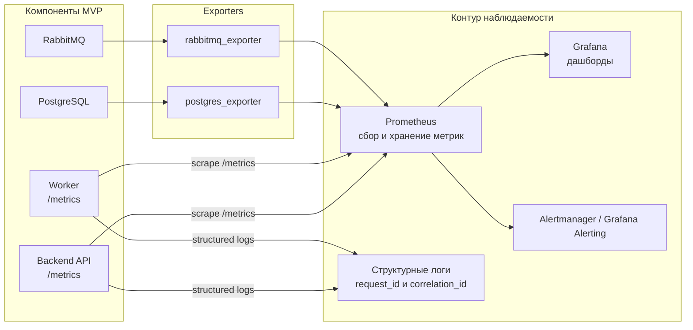

# 09. Надежность и эксплуатация

## Возможные отказы

| Отказ | Последствие | Реакция системы |
|---|---|---|
| Backend API перезапустился во время запроса | Пользователь может повторить команду | Idempotency key возвращает прежний результат |
| Worker упал после обработки задания | Сообщение может быть доставлено повторно | Проверка состояния и идемпотентное применение перехода |
| RabbitMQ временно недоступен | Новые фоновые задания не публикуются | API возвращает ошибку или сохраняет outbox-запись для повторной публикации |
| PostgreSQL недоступен | Нельзя менять состояние | API закрывает операции записи, алерт операторам |
| Расписание недоступно | Нельзя назначить рейс при приемке | API не завершает приемку рейсом, оператор видит проблему и повторяет действие после восстановления |
| Ближайший рейс закрыт для приема | Отправление не успевает на поезд | Система назначает следующий доступный рейс |
| Провайдер уведомлений недоступен | Клиент не получает сообщение вовремя | Повторы, оператор видит неуспешные уведомления |
| Object storage недоступен | Нельзя сохранить фото отказа или претензии | Операция отклоняется или переводится в ручное разбирательство |

## Наблюдаемость: Prometheus и Grafana

Для MVP наблюдаемость выделяется в отдельный эксплуатационный контур. Backend API и Worker отдают технические и бизнес-метрики в формате Prometheus, а Prometheus регулярно собирает их вместе с метриками PostgreSQL и RabbitMQ через exporter'ы. Grafana использует Prometheus как источник данных для дашбордов и алертов.

Prometheus не является источником бизнес-истины и не заменяет историю статусов в PostgreSQL. В метках метрик нельзя хранить персональные данные, полный номер отправления, код выдачи или другие значения с высокой кардинальностью.

## Минимальные метрики

| Метрика | Источник | Зачем |
|---|---|---|
| `http_requests_total`, `http_request_duration_seconds` | Backend API | Видеть ошибки и задержки пользовательских и операторских запросов |
| `shipments_by_status` | Backend API / PostgreSQL | Видеть зависшие этапы перевозочного потока |
| `shipment_stage_duration_seconds` | Backend API | Контролировать длительность этапов: ожидание сдачи, приемка, назначение рейса, перевозка, выдача |
| `worker_jobs_processed_total`, `worker_job_duration_seconds` | Worker | Проверять, что фоновые задачи реально выполняются |
| `worker_job_lag_seconds` | Worker / RabbitMQ | Обнаруживать деградацию worker и рост задержек |
| `rabbitmq_queue_messages_ready`, `rabbitmq_queue_messages_unacked` | RabbitMQ exporter | Видеть накопление заданий и зависшие обработки |
| `postgres_up`, `pg_stat_activity_count` | PostgreSQL exporter | Контролировать доступность и нагрузку БД |
| `external_integration_errors_total` | Backend API / Worker | Видеть проблемы расписания, расчета условий и провайдера уведомлений |
| `notification_attempts_total` | Worker | Разделять успешные, повторные и неуспешные уведомления |
| `dropoff_timeout_total` | Worker | Контролировать несданные заявки и временные ограничения пользователей |
| `station_check_rejected_total` | Backend API | Анализировать причины отказов при вокзальной приемке |
| `claim_opened_total` | Backend API | Следить за претензиями и качеством сервиса |
| `access_denied_total` | Backend API | Видеть попытки доступа к чужим отправлениям |

## Панели Grafana

Минимальный набор дашбордов:

- здоровье системы: доступность API, Worker, PostgreSQL и RabbitMQ;
- перевозочный поток: количество отправлений по статусам и возраст отправлений в каждом статусе;
- вокзальная приемка: число принятых отправлений, отказы и причины отказов;
- фоновые задачи: размер очередей, задержка заданий, ошибки и повторы worker;
- интеграции: ошибки расписания, расчета условий и уведомлений;
- безопасность: ошибки доступа, подозрительные попытки просмотра чужих отправлений;
- претензии: количество открытых претензий, причины и среднее время закрытия.

Алерты нужны минимум для недоступности PostgreSQL или RabbitMQ, роста 5xx-ошибок API, накопления очереди уведомлений, задержки автоотмен, недоступности системы расписания и появления отправлений, которые слишком долго остаются в промежуточном статусе.

## Логи

Каждая запись должна по возможности содержать:

- `request_id`;
- `correlation_id`;
- `shipment_id`;
- `tracking_number`;
- `user_id` или `operator_id`;
- `stage`;
- `attempt`;
- `external_provider`;
- `error_code`.

В логи нельзя писать полный код выдачи, документы, полные персональные данные, содержимое отправления и ссылки на приватные фото без контроля доступа.

## Ручные операции оператора

| Операция | Ограничение |
|---|---|
| Повторить назначение рейса | Только если отправление принято и еще не передано в поезд |
| Зафиксировать отказ в приемке | Только с причиной и фото несоответствия |
| Зафиксировать выдачу | Только для статуса `ready_for_pickup` |
| Открыть претензию от имени клиента | Только с причиной и комментарием |
| Закрыть претензию | Только после заполнения решения |
| Повторить уведомление | Только если прежняя попытка неуспешна или устарела |
| Исправить контакт получателя | Только с записью в audit trail |

## Резервное копирование

- PostgreSQL копируется регулярно, минимум ежедневно для учебного MVP.
- Перед миграциями делается резервная копия.
- RabbitMQ не является источником истины; потерянные задания восстанавливаются по состоянию БД.
- Object storage должен иметь lifecycle policy и резервирование для фото отказов и материалов претензий.
