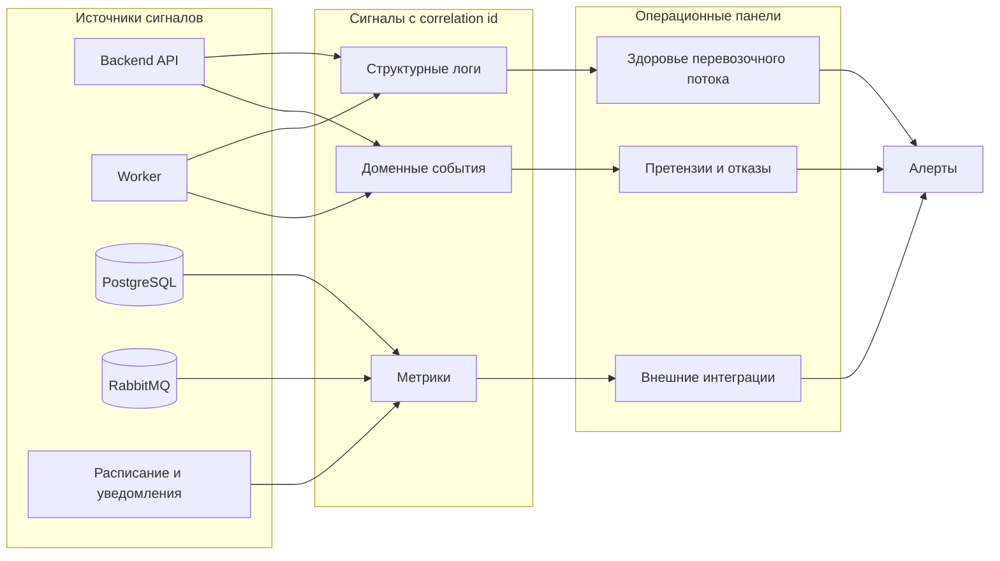

# 09. Надежность и эксплуатация

## Возможные отказы

| Отказ | Последствие | Реакция системы |
|---|---|---|
| Backend API перезапустился во время запроса | Пользователь может повторить команду | Idempotency key возвращает прежний результат |
| Worker упал после обработки задания | Сообщение может быть доставлено повторно | Проверка состояния и идемпотентное применение перехода |
| RabbitMQ временно недоступен | Новые фоновые задания не публикуются | API возвращает ошибку или сохраняет outbox-запись для повторной публикации |
| PostgreSQL недоступен | Нельзя менять состояние | API закрывает операции записи, алерт операторам |
| Расписание недоступно | Нельзя назначить рейс при приемке | API не завершает приемку рейсом, оператор видит проблему и повторяет действие после восстановления |
| Ближайший рейс закрыт для приема | Отправление не успевает на поезд | Система назначает следующий доступный рейс |
| Провайдер уведомлений недоступен | Клиент не получает сообщение вовремя | Повторы, оператор видит неуспешные уведомления |
| Object storage недоступен | Нельзя сохранить фото отказа или претензии | Операция отклоняется или переводится в ручное разбирательство |

## Наблюдаемость

## Минимальные метрики

| Метрика | Зачем |
|---|---|
| Количество заявок по статусам | Видеть зависшие этапы |
| Возраст задач в очереди | Обнаруживать деградацию worker |
| Длительность этапов: ожидание сдачи, приемка, назначение рейса, перевозка, выдача | Искать узкие места |
| Количество повторов внешних вызовов | Видеть проблемы интеграций |
| Количество несданных заявок на пользователя | Контролировать злоупотребления |
| Число отказов в приемке и причины | Контролировать качество входящего потока |
| Число претензий и причины | Контролировать качество сервиса |
| Ошибки доступа и попытки просмотра чужих отправлений | Контроль безопасности |

## Логи

Каждая запись должна по возможности содержать:

- `request_id`;
- `correlation_id`;
- `shipment_id`;
- `tracking_number`;
- `user_id` или `operator_id`;
- `stage`;
- `attempt`;
- `external_provider`;
- `error_code`.

В логи нельзя писать полный код выдачи, документы, полные персональные данные, содержимое отправления и ссылки на приватные фото без контроля доступа.

## Ручные операции оператора

| Операция | Ограничение |
|---|---|
| Повторить назначение рейса | Только если отправление принято и еще не передано в поезд |
| Зафиксировать отказ в приемке | Только с причиной и фото несоответствия |
| Зафиксировать выдачу | Только для статуса `ready_for_pickup` |
| Открыть претензию от имени клиента | Только с причиной и комментарием |
| Закрыть претензию | Только после заполнения решения |
| Повторить уведомление | Только если прежняя попытка неуспешна или устарела |
| Исправить контакт получателя | Только с записью в audit trail |

## Резервное копирование

- PostgreSQL копируется регулярно, минимум ежедневно для учебного MVP.
- Перед миграциями делается резервная копия.
- RabbitMQ не является источником истины; потерянные задания восстанавливаются по состоянию БД.
- Object storage должен иметь lifecycle policy и резервирование для фото отказов и материалов претензий.
