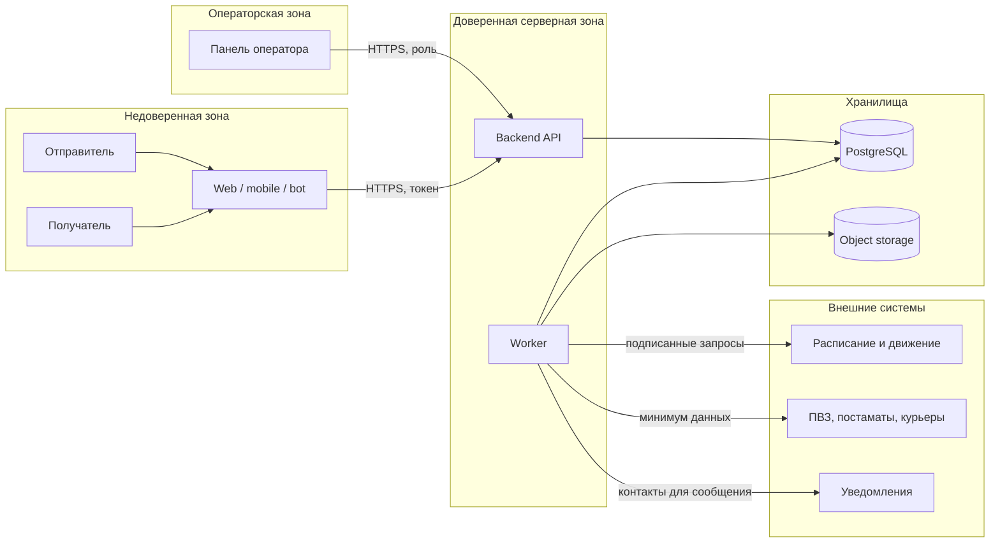

# 10. Безопасность

## Роли

| Роль | Права |
|---|---|
| Отправитель | Создает свои заявки, видит свои отправления и статусы |
| Получатель | Видит ограниченную информацию по коду или ссылке получения |
| Оператор приема | Видит заявки своего пункта приема, фиксирует проверку |
| Логистический оператор | Видит отправления в перевозке и проблемные переходы |
| Служба поддержки | Видит историю, обращения и расследования |
| Администратор | Управляет справочниками, ролями и настройками интеграций |

## Границы доверия

## Защищаемые данные

- контакты отправителя и получателя;
- адреса пунктов приема и выдачи в привязке к конкретному отправлению;
- стоимость и условия перевозки;
- история статусов;
- причины отказа и материалы расследования;
- код выдачи;
- внешние идентификаторы партнеров.

## Основные меры

| Угроза | Мера |
|---|---|
| Пользователь смотрит чужое отправление | Ownership check для каждого запроса |
| Оператор меняет чужую зону ответственности | Ролевая модель и привязка к пунктам/направлениям |
| Повторное внешнее событие меняет статус | external event id и проверка допустимого перехода |
| Утечка кода выдачи | Хранить hash, показывать код только получателю |
| Лишние данные уходят партнеру | Адаптеры передают только нужный минимум |
| Секреты попали в код | Хранить секреты в переменных окружения или secret manager |
| Персональные данные попали в логи | Маскирование и запрет логирования чувствительных полей |

## Валидация входов

- Клиентские поля проверяются на API, а не только в интерфейсе.
- Внешние события проверяются по подписи или секрету webhook.
- Переход статуса проверяется доменной моделью.
- Файлы расследования проверяются по типу, размеру и доступу.
- Идентификаторы внешних систем не используются как внутренние первичные ключи.

## Открытые вопросы

- Нужно уточнить требования 152-ФЗ и внутренние правила перевозчика по хранению персональных данных.
- Нужно определить, какие данные можно передавать конкретным партнерам последней мили.
- Нужен регламент доступа сотрудников поддержки к истории отправления.

