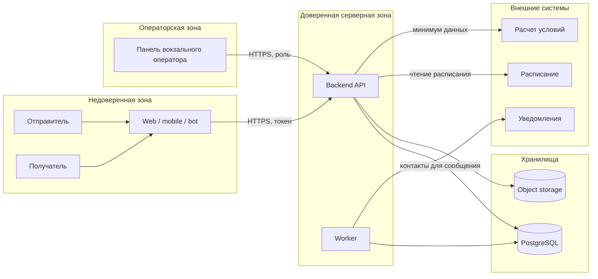

# 10. Безопасность

## Роли

| Роль | Права |
|---|---|
| Отправитель | Создает свои заявки, видит свои отправления и статусы |
| Получатель | Видит разрешенную историю по номеру отправления, коду или ссылке получения |
| Оператор вокзального пункта | Видит заявки своего пункта, фиксирует приемку, отказ, фото и выдачу |
| Служба поддержки | Видит историю, отказы, обращения и претензии |
| Администратор | Управляет справочниками, ролями и настройками интеграций |

## Границы доверия

## Защищаемые данные

- контакты отправителя и получателя;
- направление и вокзальные пункты в привязке к конкретному отправлению;
- стоимость и условия перевозки;
- история статусов;
- причины отказа;
- фото отказа и материалы претензии;
- код выдачи;
- внешние идентификаторы партнеров.

## Основные меры

| Угроза | Мера |
|---|---|
| Пользователь смотрит чужое отправление | Ownership check для каждого запроса |
| Получатель видит лишние данные отправителя | Разделение представлений истории для отправителя, получателя и оператора |
| Оператор меняет чужую зону ответственности | Ролевая модель и привязка к вокзальным пунктам |
| Повторное внешнее событие меняет статус | external event id и проверка допустимого перехода |
| Утечка кода выдачи | Хранить hash, показывать код только получателю |
| Лишние данные уходят во внешнюю систему | Адаптеры передают только нужный минимум |
| Секреты попали в код | Хранить секреты в переменных окружения или secret manager |
| Персональные данные попали в логи | Маскирование и запрет логирования чувствительных полей |
| Фото отказа или претензии стало публичным | Приватное object storage, временные ссылки, проверка прав через API |

## Персональные данные и законодательство РФ

Система хранит персональные данные отправителя и получателя, поэтому проектирование должно учитывать требования законодательства РФ о персональных данных. Для курсовой это означает архитектурные требования:

- минимизировать состав собираемых персональных данных;
- ограничивать доступ по ролям и владению отправлением;
- не писать персональные данные и приватные ссылки в технические логи;
- хранить секреты и ключи вне кода;
- фиксировать доступ оператора к чувствительным данным в audit trail;
- отдельно определить сроки хранения персональных данных, фото и материалов претензий перед промышленной эксплуатацией.

Конкретный юридический режим, формы согласий и сроки хранения должны быть уточнены с профильными специалистами перед пилотом.

## Валидация входов

- Клиентские поля проверяются на API, а не только в интерфейсе.
- Внешние события проверяются по подписи или секрету webhook, если используются.
- Переход статуса проверяется доменной моделью.
- Фото отказа и материалы претензии проверяются по типу, размеру и доступу.
- Идентификаторы внешних систем не используются как внутренние первичные ключи.

## Открытые вопросы

- Нужно уточнить точный состав персональных данных и сроки хранения.
- Нужно определить, какие данные видит получатель до фактической выдачи.
- Нужен регламент доступа сотрудников поддержки к истории отправления и материалам претензии.
