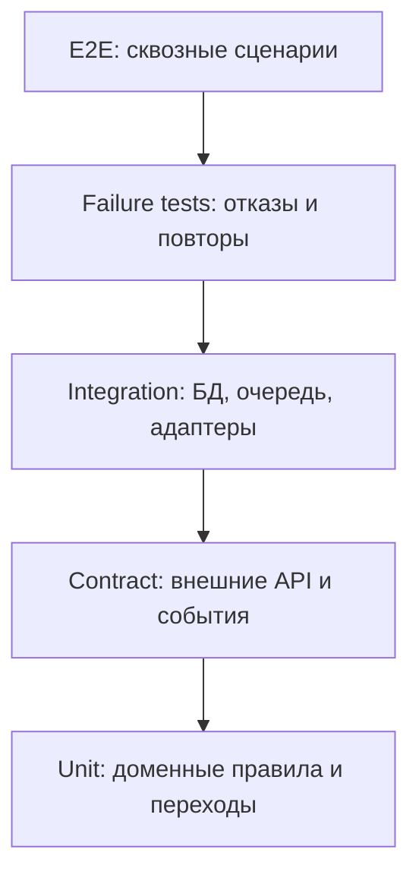

# 11. Тестирование

## Стратегия

Тестирование должно подтверждать не только интерфейс, но и архитектурные свойства: корректность статусов, идемпотентность, работу очереди, безопасность доступа и устойчивость к отказам внешних систем.

## Матрица проверок

| Область | Что проверить | Тип проверки |
|---|---|---|
| Создание заявки | Валидная заявка сохраняется, невалидная отклоняется | Unit, API, E2E |
| Отмена через 24 часа | Worker отменяет только ожидающие сдачи заявки | Integration, time-based test |
| Приемка | Оператор принимает или отклоняет отправление с причиной | E2E |
| Подбор поезда | Система выбирает ближайший допустимый поезд | Integration с fake расписанием |
| Передача ЛНП | Нельзя передать отправление без приемки и маршрута | Unit, integration |
| Прибытие | Внешнее событие меняет статус один раз | Contract, idempotency |
| Выдача | Код выдачи создается и используется один раз | Integration, security |
| Повреждение | Открывается расследование и блокируется обычная выдача | E2E, domain tests |
| Доступ | Пользователь не видит чужое отправление | Security integration |
| Уведомления | Ошибки провайдера повторяются без потери статуса | Failure test |

## Обязательные сценарии приемки

1. Успешный путь: заявка, сдача, приемка, маршрут, поезд, прибытие, постамат, выдача.
2. Ошибка формы: заявка не создается, пользователь видит причины.
3. Несдача за 24 часа: заявка отменяется автоматически.
4. Отказ при физической проверке: статус закрывается с причиной.
5. Нет доступного поезда: отправление остается в ожидании маршрута, оператор видит проблему.
6. Повтор события прибытия: статус и история не дублируются.
7. Падение worker после обработки: повтор не ломает состояние.
8. Повреждение: открывается расследование, отправляется уведомление.
9. Попытка доступа к чужому отправлению: API возвращает отказ.

## Контрактные тесты

| Контракт | Проверки |
|---|---|
| Расписание поездов | Формат рейса, время отправления/прибытия, направление, недоступность сервиса |
| События движения | `external_event_id`, статус, время, подпись, повторная доставка |
| Последняя миля | Создание передачи, код выдачи, отказ партнера, повтор запроса |
| Уведомления | Успешная отправка, ошибка провайдера, недопустимый контакт |
| Расчет стоимости | Габариты, направление, ограничения, отказ расчета |

## Нагрузочные проверки MVP

- API создания заявки не зависит от скорости внешних систем.
- Очередь не растет бесконечно при задержке расписания или уведомлений.
- Панель оператора быстро открывает список проблемных отправлений.
- Индексы по `tracking_number`, `current_status`, `dropoff_deadline` и `external_event_id` покрывают частые запросы.

## Ручная проверка

Перед защитой курсовой нужно вручную пройти демонстрационный сценарий и сверить:

- статусы на диаграмме и в требованиях совпадают;
- операторские действия имеют понятные причины;
- все сложные решения имеют ADR;
- Mermaid-схемы рендерятся без ошибок.

