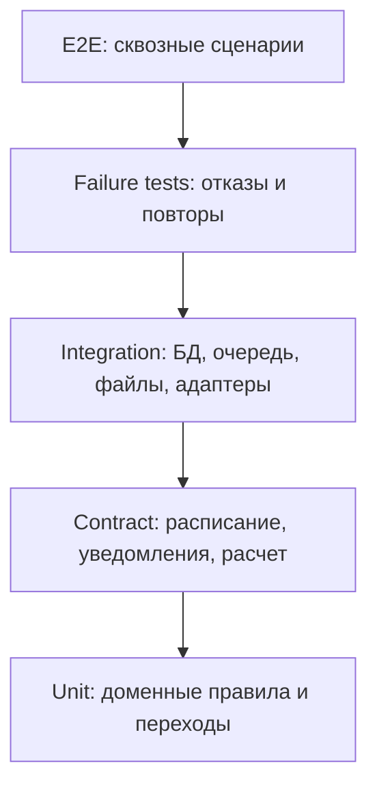

# 11. Тестирование

## Стратегия

Тестирование должно подтверждать не только интерфейс, но и архитектурные свойства: корректность статусов, идемпотентность, работу очереди, безопасность доступа, хранение фото отказов, временные ограничения за несданные заявки и обработку претензий.

## Матрица проверок

| Область | Что проверить | Тип проверки |
|---|---|---|
| Создание заявки | Валидная заявка сохраняется, невалидная отклоняется | Unit, API, E2E |
| Отмена через 24 часа | Worker отменяет только ожидающие сдачи заявки | Integration, time-based test |
| Повторные несдачи | Несколько отмен по таймауту за неделю дают временное ограничение | Unit, integration |
| Приемка | Оператор принимает или отклоняет отправление с причиной | E2E |
| Фото отказа | При отказе фото обязательно сохраняется и доступно только разрешенным ролям | Integration, security |
| Назначение рейса | Система выбирает ближайший рейс с открытым приемом или следующий рейс | Integration с fake расписанием |
| Передача ЛНП | Нельзя передать отправление без приемки и назначенного рейса | Unit, integration |
| Прибытие | Нельзя выдать отправление до прибытия на вокзал назначения | Unit, integration |
| Выдача | Код выдачи создается, проверяется и используется один раз | Integration, security |
| Претензия | Клиент может открыть претензию после выдачи или при проблеме выдачи | E2E, domain tests |
| Доступ | Пользователь не видит чужое отправление; получатель видит только разрешенную историю | Security integration |
| Уведомления | Ошибки провайдера повторяются без потери статуса | Failure test |

## Обязательные сценарии приемки

1. Успешный путь: заявка, сдача на вокзале, приемка, назначение рейса, поезд, прибытие, вокзальная выдача.
2. Ошибка формы: заявка не создается, пользователь видит причины.
3. Несдача за 24 часа: заявка отменяется автоматически.
4. Несколько несданных заявок: пользователь временно ограничивается в создании новых заявок.
5. Отказ при физической проверке: статус закрывается с причиной и фото несоответствия.
6. Прием к погрузке на ближайший рейс закрыт: отправление назначается на следующий рейс.
7. Повтор события расписания: статус и история не дублируются.
8. Падение worker после обработки: повтор не ломает состояние.
9. Претензия клиента: обращение открывается, материалы сохраняются, поддержка закрывает решение.
10. Попытка доступа к чужому отправлению: API возвращает отказ.

## Контрактные тесты

| Контракт | Проверки |
|---|---|
| Расписание поездов | Формат рейса, время отправления/прибытия, cutoff приема, направление, недоступность сервиса |
| События расписания | `external_event_id`, статус, время, подпись, повторная доставка |
| Уведомления | Успешная отправка, ошибка провайдера, недопустимый контакт |
| Расчет условий | Габариты, направление, ограничения, отказ расчета |
| Object storage | Загрузка фото, получение приватной ссылки, отказ при превышении размера |

## Нагрузочные проверки MVP

- API создания заявки не зависит от скорости внешних систем.
- Очередь не растет бесконечно при задержке расписания или уведомлений.
- Панель оператора быстро открывает список отправлений на приемку и выдачу.
- Индексы по `tracking_number`, `current_status`, `dropoff_deadline`, `train_leg_id` и `external_event_id` покрывают частые запросы.

## Ручная проверка

Перед защитой курсовой нужно вручную пройти демонстрационный сценарий и сверить:

- статусы на диаграмме и в требованиях совпадают;
- операторские действия имеют понятные причины;
- отказ без фото невозможен;
- получатель видит только разрешенную часть истории;
- все сложные решения имеют ADR;
- Mermaid-схемы рендерятся без ошибок.

